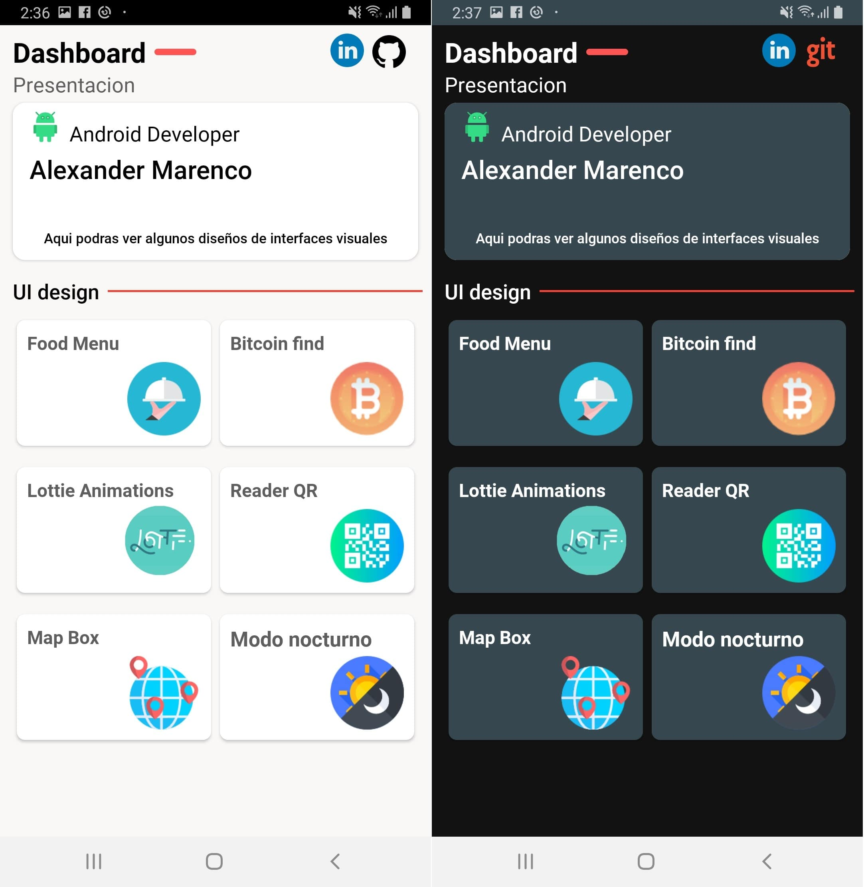

# UI design

### Aplicacion movil

El objetivo es implementar los conocimientos adquiridos en una sola app.
Tanto diseño de intefaces visuales como aquitecturas como MVVM.

Tecnologias y librerias utilizadas (y por utilizar):

1. Kotlin
2. AndroidX
3. Navigation
4. Konfetti
5. Ripplebackground
6. Lottie
7. Mapboxsdk
8. ElasticViews
9. Retrofit2
10. Coroutines
11. CircleImageView

### Diseño de la app

 

### Un poco de todo

SharedPrefrences, LiveData, LifeCycle, Intents, Navigation Component (fragments), PermissionsManager | requestPermissions, JSON, XML, Shape xml, NestedScrollView, CollapsingToolbarLayout
 
### Inspiración

https://dribbble.com

https://lottiefiles.com

https://google.com

https://youtube.com

### Realizado por [*Alexander Marenco*](https://github.com/AlexM505) Copyright (C) 2020

